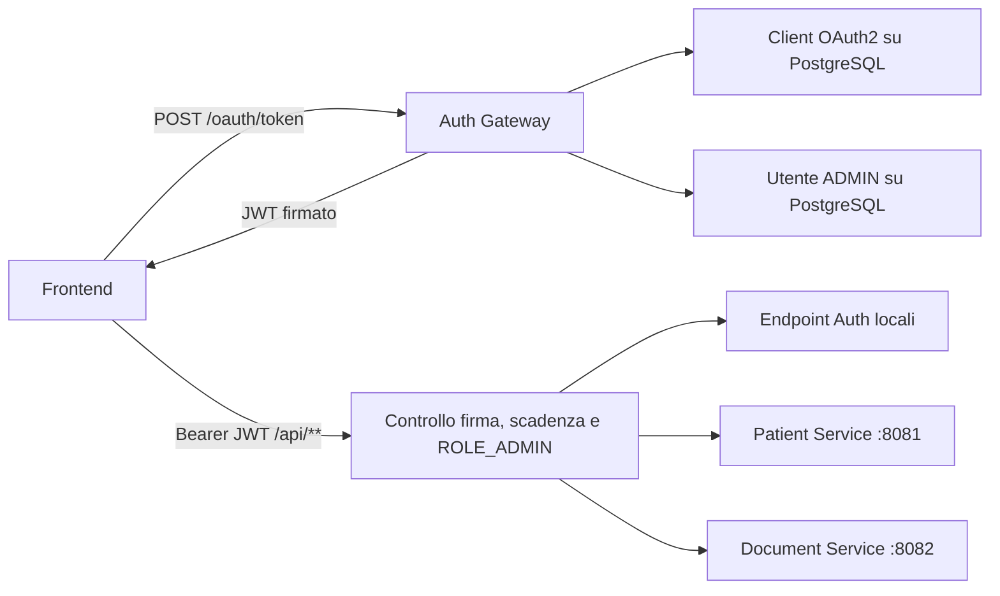

```mermaid
flowchart LR
    A["Frontend"] -->|"POST /oauth/token"| B["Auth Gateway"]
    B --> C["Client OAuth2 su PostgreSQL"]
    B --> D["Utente ADMIN su PostgreSQL"]
    B -->|"JWT firmato"| A
    A -->|"Bearer JWT /api/**"| E["Controllo firma, scadenza e ROLE_ADMIN"]
    E --> F["Endpoint Auth locali"]
    E --> G["Patient Service :8081"]
    E --> H["Document Service :8082"]
```
